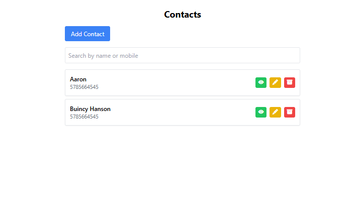
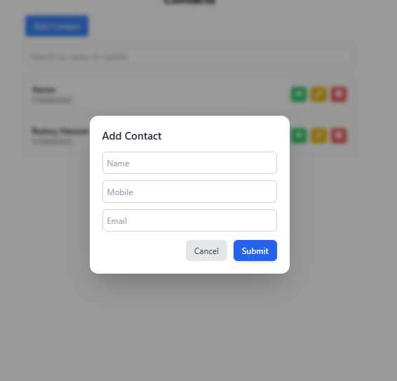
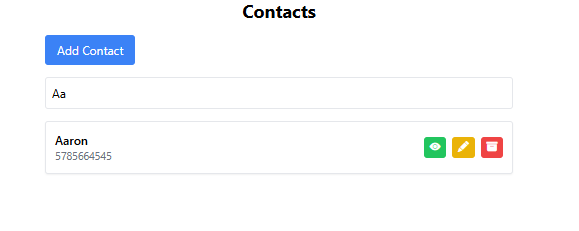
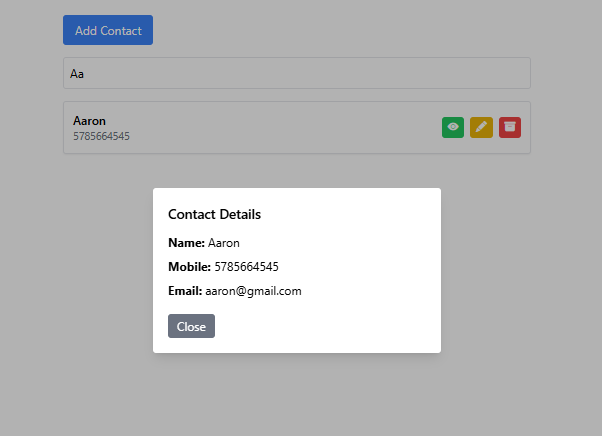
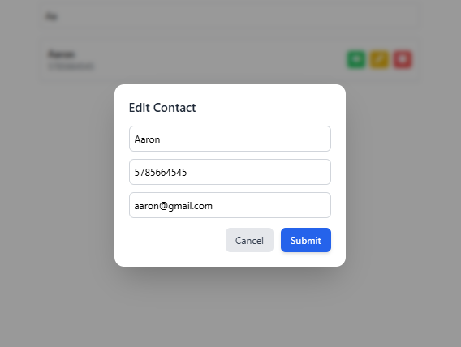

# React Assignment - Bitcot

## 📌 Project Overview

This project is developed as part of the Bitcot Technologies assignment.
It is a React-based application that demonstrates form handling, validation, and UI design.

---

## 🚀 Features

* Add / Edit / Delete functionality
* Form validation
* Responsive UI using Tailwind CSS
* Clean component-based architecture

---

## 🛠️ Tech Stack

* React JS
* JavaScript (ES6+)
* Tailwind CSS

---
## Screenshots

## Home Page


## Form 


## Search list


## contact List


## Edit contact List


---

## ▶️ How to Run the Project

1. Clone the repository
2. Install dependencies

```bash
npm install
```

3. Start the development server

```bash
npm start
```

---

## 📂 Folder Structure

* `/components` → reusable components
* `/pages` → main pages
* `/utils` → helper functions

---

## 👩‍💻 Author

Abinaya
